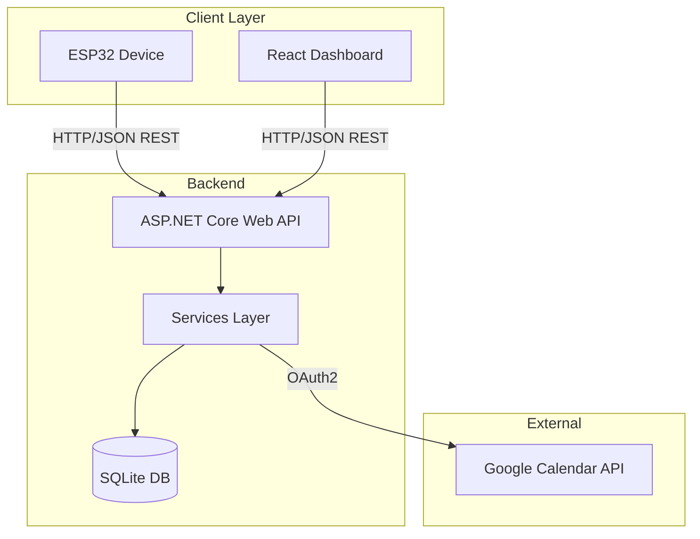

# DeskBuddy System Architecture

## Overview

## Communication

| From | To | Protocol |
|---|---|---|
| ESP32 Device | Backend API | HTTP/JSON (API Key) |
| React Dashboard | Backend API | HTTP/JSON (JWT) |
| Backend | SQLite | EF Core (local) |
| Backend | Google Calendar | REST / OAuth2 |

## Components

- **ASP.NET Core Web API** — central backend, exposes REST endpoints
- **Services Layer** — business logic (Now/Next, device status, calendar sync)
- **SQLite DB** — local persistence via EF Core (Devices, CalendarEvents)
- **React Dashboard** — web admin UI with login, monitoring and calendar view
- **ESP32 Device** — IoT client, sends heartbeat/status, receives Now/Next
- **Google Calendar API** — external calendar source, read via OAuth2
