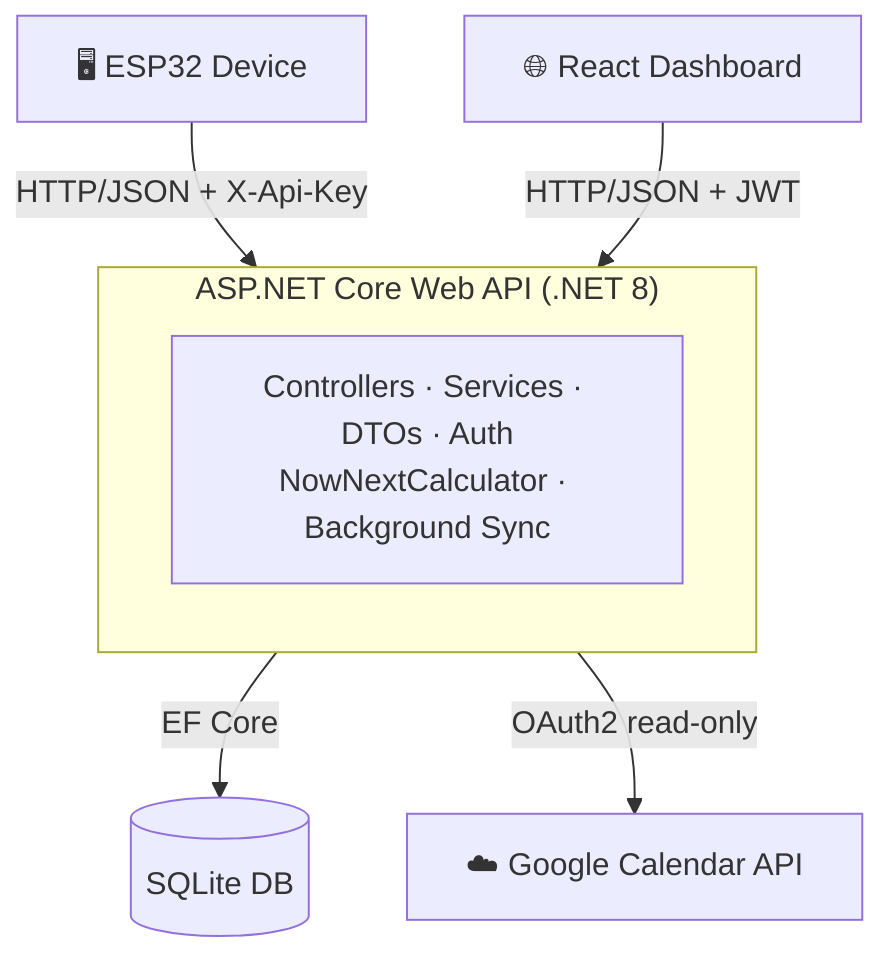

# DeskBuddy — System Architecture (Presentation)

```mermaid
graph TB
    ESP32["🖥️ ESP32 Device"]
    REACT["🌐 React Dashboard"]

    subgraph API["ASP.NET Core Web API (.NET 8)"]
        CORE["Controllers · Services · DTOs · Auth\nNowNextCalculator · Background Sync"]
    end

    DB[("SQLite DB")]
    GCAL["☁️ Google Calendar API"]

    ESP32  -->|"HTTP/JSON + X-Api-Key"| API
    REACT  -->|"HTTP/JSON + JWT"| API
    API    -->|"EF Core"| DB
    API    -->|"OAuth2 read-only"| GCAL
```

---

| Component | Role |
|---|---|
| **React Dashboard** | Admin and monitoring client — login, device status, calendar view |
| **ESP32 Device** | Physical desk device — sends heartbeat, displays current and next event |
| **ASP.NET Core Web API** | Central backend — authentication, business logic, data access, calendar sync |
| **SQLite DB** | Local persistence — stores Users, Devices and CalendarEvents |
| **Google Calendar API** | External event source — accessed only by the backend via OAuth2 |
