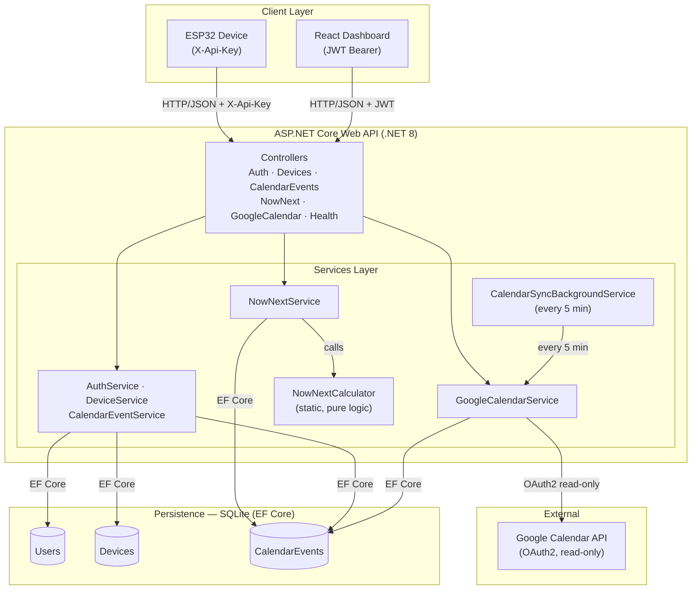

# DeskBuddy System Architecture

## Overview

```mermaid
graph TB
    subgraph Clients["Client Layer"]
        ESP32["ESP32 Device\n(X-Api-Key)"]
        REACT["React Dashboard\n(JWT Bearer)"]
    end

    subgraph Backend["ASP.NET Core Web API (.NET 8)"]
        CTRL["Controllers\nAuth · Devices · CalendarEvents\nNowNext · GoogleCalendar · Health"]

        subgraph Services["Services Layer"]
            NNS["NowNextService"]
            GCS["GoogleCalendarService"]
            SVC["AuthService · DeviceService\nCalendarEventService"]
            NNC["NowNextCalculator\n(static, pure logic)"]
            SYNC["CalendarSyncBackgroundService\n(every 5 min)"]
        end
    end

    subgraph DB["Persistence — SQLite (EF Core)"]
        TU[("Users")]
        TD[("Devices")]
        TC[("CalendarEvents")]
    end

    subgraph External["External"]
        GCAL["Google Calendar API\n(OAuth2, read-only)"]
    end

    ESP32  -->|"HTTP/JSON + X-Api-Key"| CTRL
    REACT  -->|"HTTP/JSON + JWT"| CTRL
    CTRL   --> NNS
    CTRL   --> GCS
    CTRL   --> SVC

    NNS    -->|"calls"| NNC
    NNS    -->|"EF Core"| TC
    SVC    -->|"EF Core"| TU
    SVC    -->|"EF Core"| TD
    SVC    -->|"EF Core"| TC
    SYNC   -->|"every 5 min"| GCS
    GCS    -->|"EF Core"| TC
    GCS    -->|"OAuth2 read-only"| GCAL
```

> **Note:** `NowNextCalculator` is a static helper class called by `NowNextService`.
> `CalendarSyncBackgroundService` runs inside the backend process and triggers
> `GoogleCalendarService.SyncToDbAsync()` automatically every 5 minutes.

---

## Communication

| From | To | Protocol / Auth |
|---|---|---|
| ESP32 Device | ASP.NET Core API | HTTP/JSON — `X-Api-Key` header |
| React Dashboard | ASP.NET Core API | HTTP/JSON — `Authorization: Bearer {JWT}` |
| React Dashboard | `/api/nownext` | HTTP/JSON — `X-Api-Key` header (same as ESP32) |
| ASP.NET Core API | SQLite | EF Core (local file) |
| ASP.NET Core API | Google Calendar API | HTTPS / OAuth2 (read-only) |
| CalendarSyncBackgroundService | GoogleCalendarService | Internal method call (every 5 min) |

---

## Components

| Component | Role |
|---|---|
| **ASP.NET Core Web API** | Central backend — exposes all REST endpoints |
| **AuthController** | Login (`POST /api/auth/login`), current user (`GET /api/auth/me`) |
| **DevicesController** | CRUD for devices, heartbeat, device status |
| **CalendarEventsController** | CRUD for local calendar events |
| **NowNextController** | Returns current and next event — used by ESP32 and Dashboard |
| **GoogleCalendarController** | Fetch events from Google, trigger manual sync |
| **HealthController** | `GET /api/health` — no auth required |
| **AuthService** | JWT generation, BCrypt password verification |
| **DeviceService** | CRUD, heartbeat handler, online/offline calculation from `LastSeen` |
| **CalendarEventService** | CRUD for `CalendarEvent` entities |
| **NowNextService** | Queries `CalendarEvents` from DB, delegates to `NowNextCalculator` |
| **GoogleCalendarService** | OAuth2 auth, fetches events from Google, runs Full-Replace sync |
| **CalendarSyncBackgroundService** | `BackgroundService` — calls `SyncToDbAsync()` every 5 minutes |
| **NowNextCalculator** | Static class, pure logic — `FindNow`, `FindNext`, `IsDeviceOnline` |
| **SQLite DB** | Local persistence via EF Core 8 |
| **React Dashboard** | Web admin UI — login, device status, calendar, mood animations |
| **ESP32 Device** | IoT client — heartbeat every 30 s, Now/Next display every 60 s |
| **Google Calendar API** | External event source — read-only via OAuth2 |

---

## Security

| Client | Auth Mechanism | Where validated |
|---|---|---|
| React Dashboard | JWT Bearer (`Authorization: Bearer {token}`) | `[Authorize]` attribute, JWT middleware |
| ESP32 Device | API Key (`X-Api-Key` header) | `ApiKeyAuthFilter` / `[ApiKeyAuth]` attribute |
| Public endpoints | None | `GET /api/health`, `POST /api/auth/login` |

**JWT:** Issued by `AuthService` on login, 8-hour expiry, signed with the key from `appsettings.json`.
Admin user is created automatically at startup if it does not exist.

**API Key:** A single global key stored in `appsettings.json → Device:ApiKey`.
`ApiKeyAuthFilter` reads the `X-Api-Key` header and compares it against the configured value.
Applied via the `[ApiKeyAuth]` attribute on `NowNextController` and the heartbeat endpoint.

**Google OAuth2 credentials** are stored in `Secrets/` (git-ignored) and never committed.

---

## Persistence

Three tables in the local SQLite database (`deskbuddy.db`):

| Table | Key fields | Purpose |
|---|---|---|
| `Users` | Id, Username, PasswordHash | Admin login — password hashed with BCrypt |
| `Devices` | Id, Name, ApiKey, BatteryLevel, Mood, Mode, LastSeen | Device registration and real-time status |
| `CalendarEvents` | Id, GoogleEventId, Title, StartTime, EndTime, Location, Description, FetchedAt | Local copy of Google Calendar events |

`CalendarEvents` is populated exclusively by `GoogleCalendarService.SyncToDbAsync()` using a
**Full-Replace** pattern: all existing rows are deleted, then the freshly fetched events are inserted.
This avoids EF Core tracking conflicts and always produces a clean, consistent local copy.

Online/offline status is **not** stored persistently. It is calculated at query time:
`IsOnline = LastSeen > UtcNow - Device:OfflineAfterMinutes` (default: 2 minutes).
