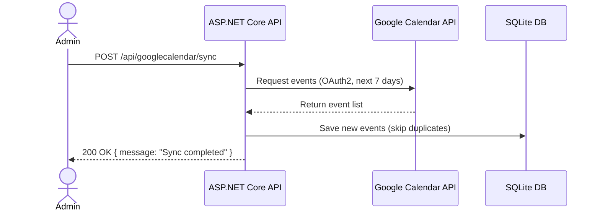
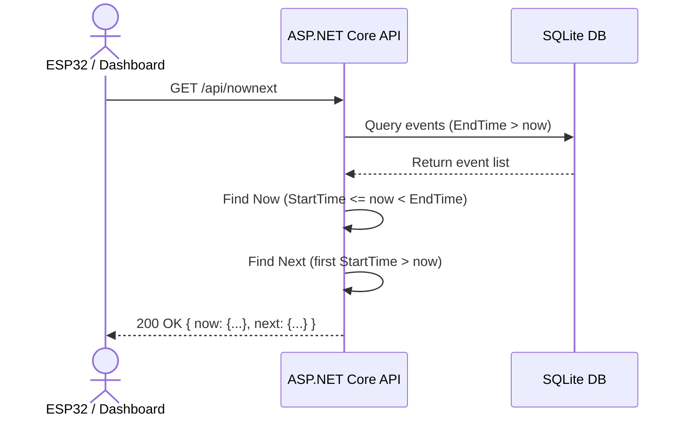

# Sequence Diagram – Google Calendar Integration

## Sync Flow (Google Calendar → Local DB)

## Now/Next Flow (Device / Dashboard)

## Notes

- Sync must be triggered before Now/Next returns real data
- Token is cached locally after first OAuth login
- Now or Next can be null if no matching event exists
