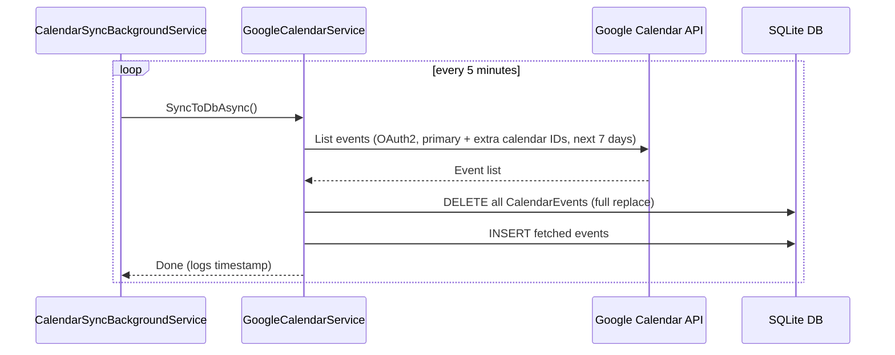
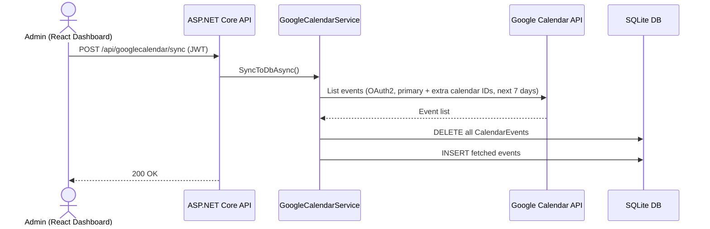
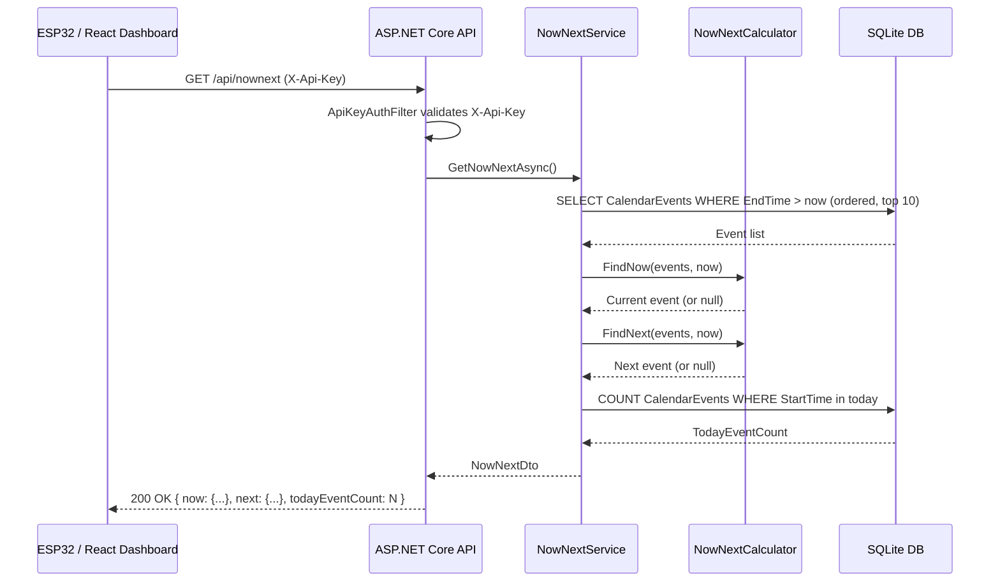
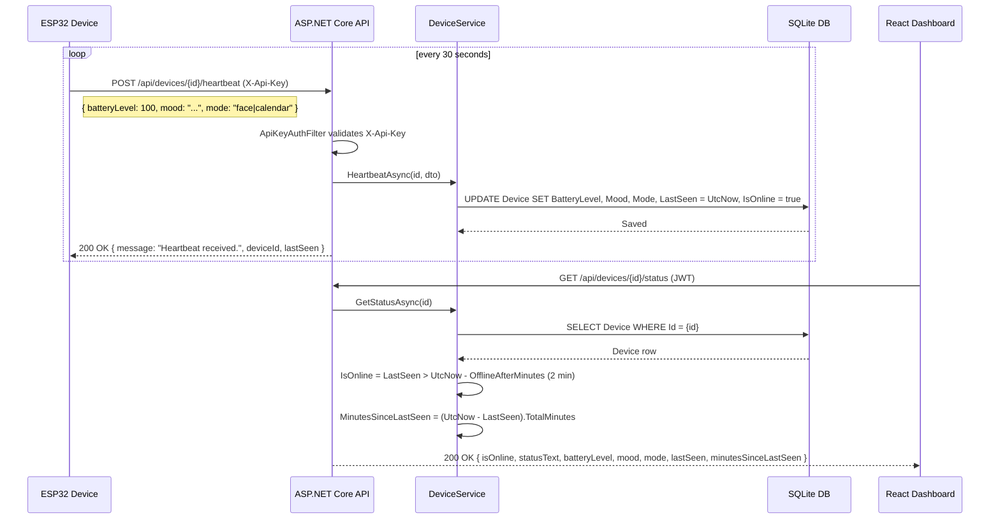

# Sequence Diagrams — DeskBuddy Backend Flows

---

## 1. Automatic Calendar Sync (CalendarSyncBackgroundService)

The backend starts a `BackgroundService` that waits 5 minutes after startup, then
syncs automatically in a continuous loop.

```mermaid
sequenceDiagram
    participant BG as CalendarSyncBackgroundService
    participant GCS as GoogleCalendarService
    participant GCAL as Google Calendar API
    participant DB as SQLite DB

    loop every 5 minutes
        BG->>GCS: SyncToDbAsync()
        GCS->>GCAL: List events (OAuth2, primary + extra calendar IDs, next 7 days)
        GCAL-->>GCS: Event list
        GCS->>DB: DELETE all CalendarEvents (full replace)
        GCS->>DB: INSERT fetched events
        GCS-->>BG: Done (logs timestamp)
    end
```

---

## 2. Manual Calendar Sync (Admin / React Dashboard)

The React Dashboard exposes a Sync button that calls `POST /api/googlecalendar/sync`.
This runs the same `SyncToDbAsync()` method as the background service.

```mermaid
sequenceDiagram
    actor Admin as Admin (React Dashboard)
    participant API as ASP.NET Core API
    participant GCS as GoogleCalendarService
    participant GCAL as Google Calendar API
    participant DB as SQLite DB

    Admin->>API: POST /api/googlecalendar/sync (JWT)
    API->>GCS: SyncToDbAsync()
    GCS->>GCAL: List events (OAuth2, primary + extra calendar IDs, next 7 days)
    GCAL-->>GCS: Event list
    GCS->>DB: DELETE all CalendarEvents
    GCS->>DB: INSERT fetched events
    API-->>Admin: 200 OK
```

---

## 3. Now/Next Flow

`GET /api/nownext` returns the currently running event, the next upcoming event,
and the total count of events today.

The endpoint is protected by `[ApiKeyAuth]` — both the ESP32 device and the
React Dashboard send the `X-Api-Key` header (the React Dashboard uses the same
device key, stored in `src/api/client.js`).

```mermaid
sequenceDiagram
    participant Client as ESP32 / React Dashboard
    participant API as ASP.NET Core API
    participant NNS as NowNextService
    participant NNC as NowNextCalculator
    participant DB as SQLite DB

    Client->>API: GET /api/nownext (X-Api-Key)
    API->>API: ApiKeyAuthFilter validates X-Api-Key
    API->>NNS: GetNowNextAsync()
    NNS->>DB: SELECT CalendarEvents WHERE EndTime > now (ordered, top 10)
    DB-->>NNS: Event list
    NNS->>NNC: FindNow(events, now)
    NNC-->>NNS: Current event (or null)
    NNS->>NNC: FindNext(events, now)
    NNC-->>NNS: Next event (or null)
    NNS->>DB: COUNT CalendarEvents WHERE StartTime in today
    DB-->>NNS: TodayEventCount
    NNS-->>API: NowNextDto
    API-->>Client: 200 OK { now: {...}, next: {...}, todayEventCount: N }
```

**NowNextCalculator logic:**
- `FindNow` — first event where `StartTime <= now < EndTime` (start inclusive, end exclusive)
- `FindNext` — earliest event where `StartTime > now` (uses `MinBy`, handles unsorted input)

---

## 4. ESP32 Heartbeat and Device Status

The ESP32 sends a heartbeat every 30 seconds to keep the backend informed of its
battery level, mood, mode and that it is still online.

The React Dashboard reads device status independently via a separate JWT-protected endpoint.

```mermaid
sequenceDiagram
    participant ESP32 as ESP32 Device
    participant API as ASP.NET Core API
    participant DS as DeviceService
    participant DB as SQLite DB
    participant REACT as React Dashboard

    loop every 30 seconds
        ESP32->>API: POST /api/devices/{id}/heartbeat (X-Api-Key)
        Note right of ESP32: { batteryLevel: 100, mood: "...", mode: "face|calendar" }
        API->>API: ApiKeyAuthFilter validates X-Api-Key
        API->>DS: HeartbeatAsync(id, dto)
        DS->>DB: UPDATE Device SET BatteryLevel, Mood, Mode, LastSeen = UtcNow, IsOnline = true
        DB-->>DS: Saved
        API-->>ESP32: 200 OK { message: "Heartbeat received.", deviceId, lastSeen }
    end

    REACT->>API: GET /api/devices/{id}/status (JWT)
    API->>DS: GetStatusAsync(id)
    DS->>DB: SELECT Device WHERE Id = {id}
    DB-->>DS: Device row
    DS->>DS: IsOnline = LastSeen > UtcNow - OfflineAfterMinutes (2 min)
    DS->>DS: MinutesSinceLastSeen = (UtcNow - LastSeen).TotalMinutes
    API-->>REACT: 200 OK { isOnline, statusText, batteryLevel, mood, mode, lastSeen, minutesSinceLastSeen }
```

---

## Notes

| Topic | Detail |
|---|---|
| Google OAuth2 | One-time manual browser login required on first run. Token is cached locally in the `Secrets/` folder. |
| Automatic sync interval | 5 minutes — first sync occurs 5 minutes after backend startup |
| Manual sync | `POST /api/googlecalendar/sync` (JWT) — runs the same full-replace sync immediately |
| Full-Replace pattern | All `CalendarEvents` are deleted and re-inserted on every sync. No upsert/merge. |
| Extra calendars | Additional calendar IDs (e.g. company ICS subscriptions) are configured in `appsettings.json → GoogleCalendar:ExtraCalendarIds` |
| Now / Next nullability | `now` and `next` in the response can be `null` if no matching event exists |
| Google API access scope | Read-only (`CalendarService.Scope.CalendarReadonly`) — no write access to Google Calendar |
| ESP32 never calls Google | The ESP32 only calls the local backend. All Google Calendar access goes through the backend. |
| React and X-Api-Key | The React Dashboard calls `/api/nownext` with `X-Api-Key`, not JWT — the endpoint is designed for device access |
| Offline threshold | Configured in `appsettings.json → Device:OfflineAfterMinutes` (default: 2). Calculated at query time, not stored. |
