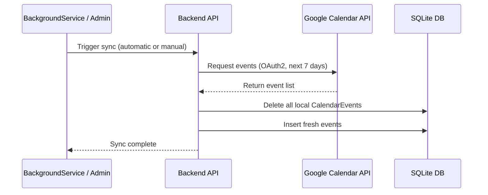
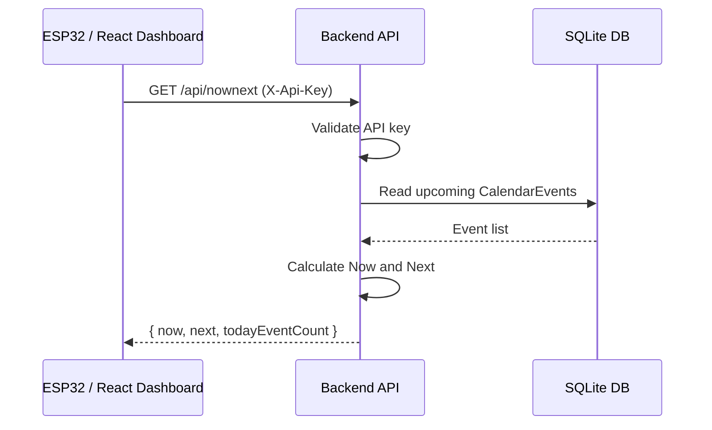
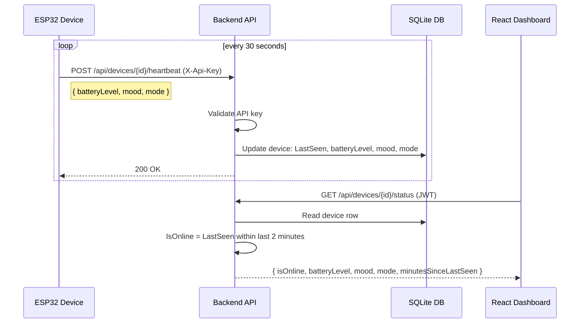

# Sequence Diagrams — DeskBuddy

---

## 1. Calendar Sync Flow

Sync runs automatically every 5 minutes via `CalendarSyncBackgroundService`.
A manual sync can also be triggered from the React Dashboard (`POST /api/googlecalendar/sync`).
Both paths use the same Full-Replace logic: all local events are deleted, then fresh events are inserted.
Google Calendar is accessed only by the backend — neither the ESP32 nor the React Dashboard talk to Google directly.

```mermaid
sequenceDiagram
    participant Trigger as BackgroundService / Admin
    participant API as Backend API
    participant GCal as Google Calendar API
    participant DB as SQLite DB

    Trigger->>API: Trigger sync (automatic or manual)
    API->>GCal: Request events (OAuth2, next 7 days)
    GCal-->>API: Return event list
    API->>DB: Delete all local CalendarEvents
    API->>DB: Insert fresh events
    API-->>Trigger: Sync complete
```

---

## 2. Now / Next Flow

The ESP32 device and the React Dashboard both call `GET /api/nownext` to get the current
and next calendar event. Both use the `X-Api-Key` header for this endpoint.
The backend reads stored events from SQLite and calculates the result — no Google Calendar call is made here.

- **Now** — the event where `StartTime <= now < EndTime`
- **Next** — the earliest upcoming event where `StartTime > now`
- `now` or `next` can be `null` if no matching event exists

```mermaid
sequenceDiagram
    participant Client as ESP32 / React Dashboard
    participant API as Backend API
    participant DB as SQLite DB

    Client->>API: GET /api/nownext (X-Api-Key)
    API->>API: Validate API key
    API->>DB: Read upcoming CalendarEvents
    DB-->>API: Event list
    API->>API: Calculate Now and Next
    API-->>Client: { now, next, todayEventCount }
```

---

## 3. ESP32 Heartbeat and Device Status

The ESP32 sends a heartbeat every 30 seconds so the backend knows it is still online.
The React Dashboard reads the device status independently using JWT.
Online/offline is not stored — it is calculated from `LastSeen` at the time of the status request.

```mermaid
sequenceDiagram
    participant ESP32 as ESP32 Device
    participant API as Backend API
    participant DB as SQLite DB
    participant React as React Dashboard

    loop every 30 seconds
        ESP32->>API: POST /api/devices/{id}/heartbeat (X-Api-Key)
        Note right of ESP32: { batteryLevel, mood, mode }
        API->>API: Validate API key
        API->>DB: Update device: LastSeen, batteryLevel, mood, mode
        API-->>ESP32: 200 OK
    end

    React->>API: GET /api/devices/{id}/status (JWT)
    API->>DB: Read device row
    API->>API: IsOnline = LastSeen within last 2 minutes
    API-->>React: { isOnline, batteryLevel, mood, mode, minutesSinceLastSeen }
```

---

## Notes

- Google OAuth2 login is required once on first backend startup — the token is cached locally
- Calendar sync runs automatically every 5 minutes (first sync is 5 minutes after startup)
- Full-Replace pattern: old local events are always deleted before inserting fresh ones
- ESP32 authenticates with `X-Api-Key` for all its endpoints (heartbeat and Now/Next)
- React Dashboard uses JWT for all admin endpoints; it also uses `X-Api-Key` for `/api/nownext`
